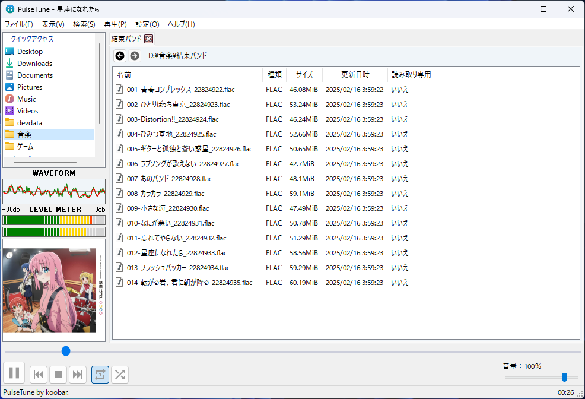

# PulseTune

## PulseTuneについて
PulseTuneは、シンプルな操作で使用できることを目標に開発された、Windows用のオーディオプレイヤーです。  
WASAPIを用いたハイレゾ音源の再生に対応しています。

↓↓スクリーンショット（2025年3月4日撮影）↓↓

## 特徴
- AAC, AIFF, FLAC, MP2, MP3, Vorbis, M4A, WAV, WMA, WavPack, [ZilophiX](https://github.com/koobar/zilophix), オーディオCDを再生できます。
- プレイリストを用いた楽曲の管理に対応しています。
- タグの表示に対応しています。（Windowsのエクスプローラで読み込み可能なフォーマットのみの対応です）
- 再生エンジンとして、[NAudio](https://github.com/naudio/NAudio) を採用しています。
- 完全無料で使用できます！

## 動作環境
- Windows 10
- Windows 11
- .NET Framework 4.8 またはそれ以降のインストールが必要です。
- ハイレゾ音源を再生する場合、ハイレゾ音源に対応したオーディオ出力デバイスが必要です。

## ダウンロード
バイナリは、[ここ](https://github.com/koobar/PulseTune/releases)からダウンロードできます。

## ライセンス
PulseTuneは、MITライセンスの下で配布されるオープンソースソフトウェアです。
PulseTuneが使用するライブラリやアイコンのライセンスについては、[ここ](./THIRD-PARTY-NOTICES.txt)をご覧ください。

PulseTuneのアイコンは、[IconKitchen](https://icon.kitchen/)を用いて作成しました。
PulseTuneのアイコンと同じ設定は、[ここ](https://icon.kitchen/i/H4sIAAAAAAAAA1WPzQrCMBCE32W99lAVxHoV8QHsTTxsk00aTJuS%2FoiUvruTQg8SSMhs5pvMTBP7UXq6zKQ5vstaGqGLYd9LRsZeves4DmncCw7SYnj0A2XkVGgh1MK6q0MLxpJRZa%2FBhwh9d9gXJ3PEw8qW3w5QspG1kzaZK3vfLkCr5Nn%2FmVbpkKQ8L07nMyRurQemyJGDn2055pgW5sbejBE1oAyJl4kHWZMeNa%2FxykUFANxN0KNPpZ%2BA6hicTn1Cj%2F0jFb2WH1f67iwXAQAA)からアクセスできます。
